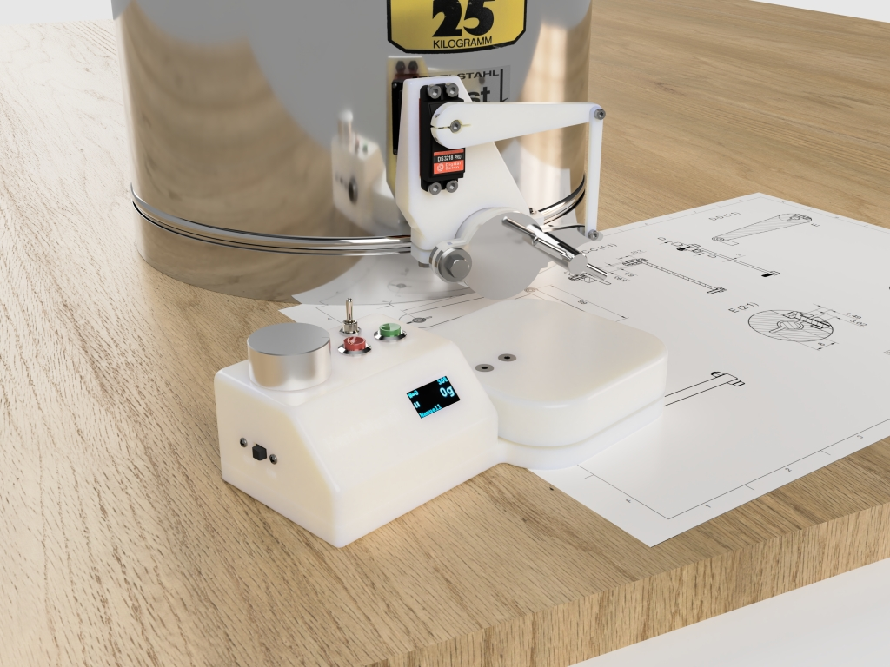
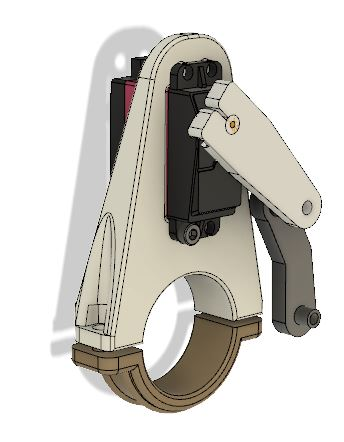
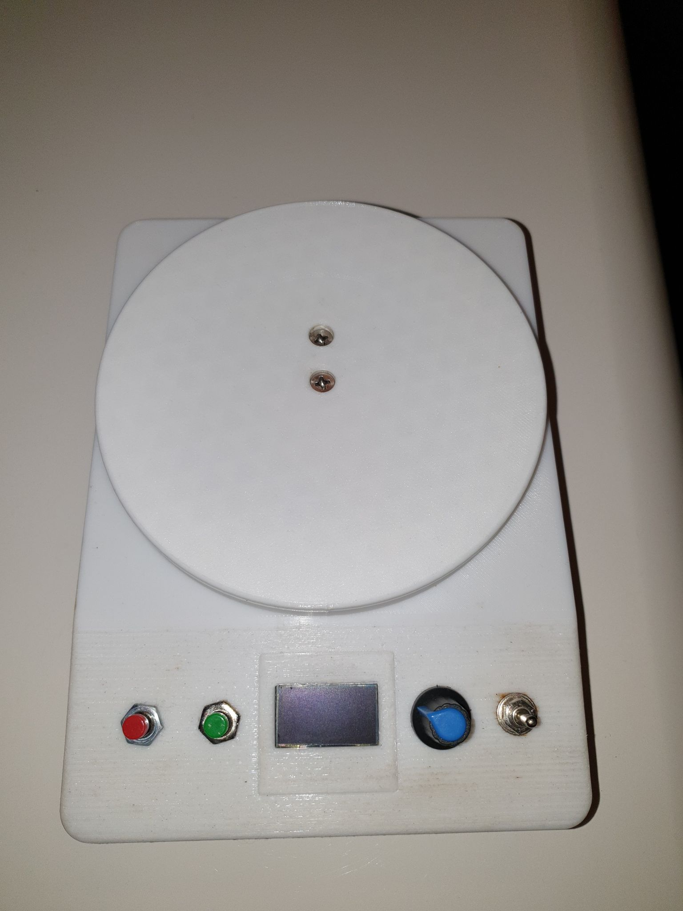

# 3D-Druck-Dateien zum HaniMandl

Neben diversen Halterungen für den Servo aus Holz, Alu-Profilen, diversem Platten-Materia und Gehäusen für die Elektronik wie sie unter https://community.hiveeyes.org/t/side-project-hanimandl-halbautomatischer-honig-abfullbehalter/768/65 und den nachfolgenden postings zu finden sind, gibt es auch Dateien, um sich entsprechende Teile mit dem 3D-Drucker erstellen zu können. 

## Variante 1 / Heilbronner Gartenhonig

Johannes Kuder von heilbronner-gartenhonig.de hat schicke Teile konstruiert, die vom Gehäuse für die Elektronik bis zum Servoarm gehen. 

## Variante 2 / Hamburg 

Michael Kurzweil / @MKO1640 hat eine Servo- und Elektronikhalterung direkt am Hahn entworfen. 

## Variante 3 / Wörth

HaniMandl wie eine "klassische" Waage von JoSef. 

## Variante 4 / flat style 

Von Markus Straub / merlin2539 gibt es bei thingiverse eine einfache Halterung, die ähnlich wie die zugeschnittene Platte von Sebastian (siehe https://community.hiveeyes.org/t/side-project-hanimandl-halbautomatischer-honig-abfullbehalter/768/65) mit den Schrauben des Quetschhahns befestigt wird:

https://www.thingiverse.com/thing:4564453

## Variante 5 / Dresden 

Von Ralf / rallef80 gibt es eine Halterung, welche direkt am Quetschhahn befestigt wird und den Schieber über einen Zahnradantrieb bewegt. Die Waage und die Kontrolleinheit werden in separaten Gehäusen untergebracht. Alle 3D-Druck-Teile und das komplette CAD-Projekt sind verfügbar unter:

https://www.printables.com/de/model/524971-filling-machine-hanimandl

