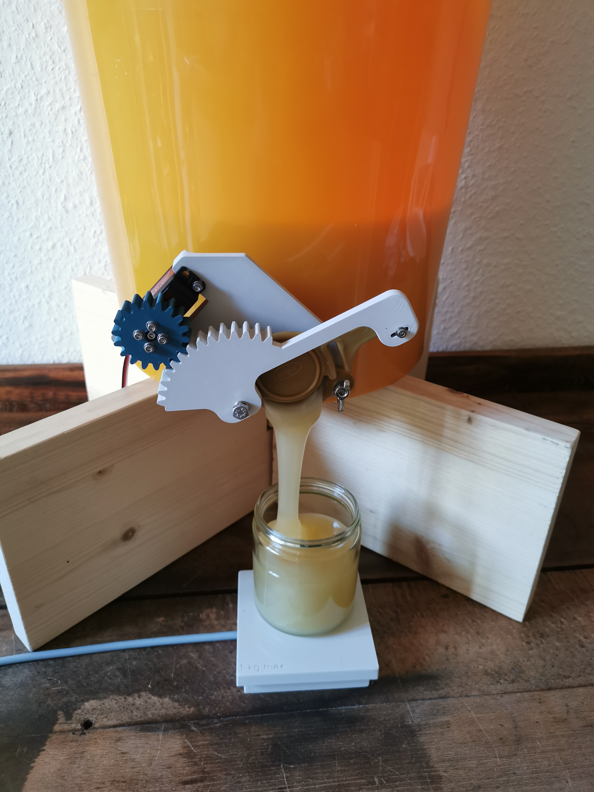
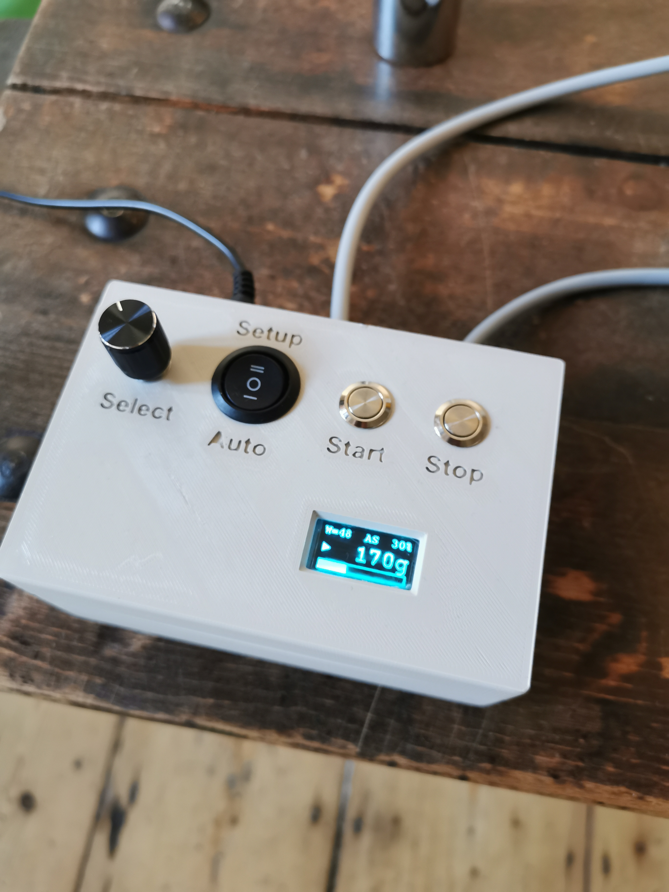
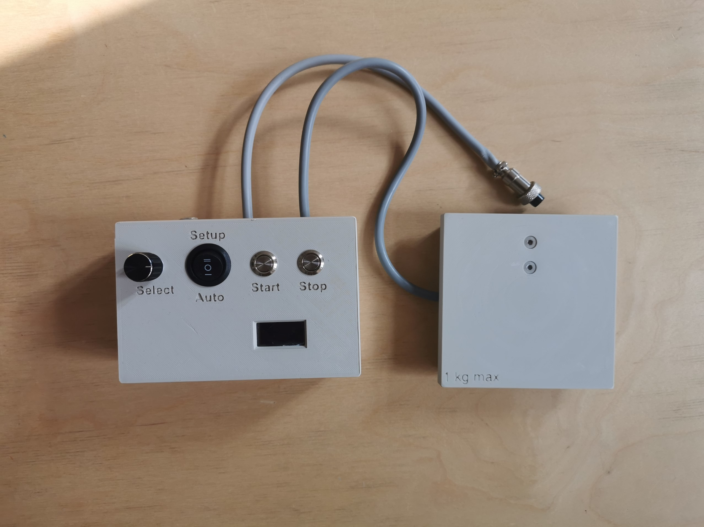
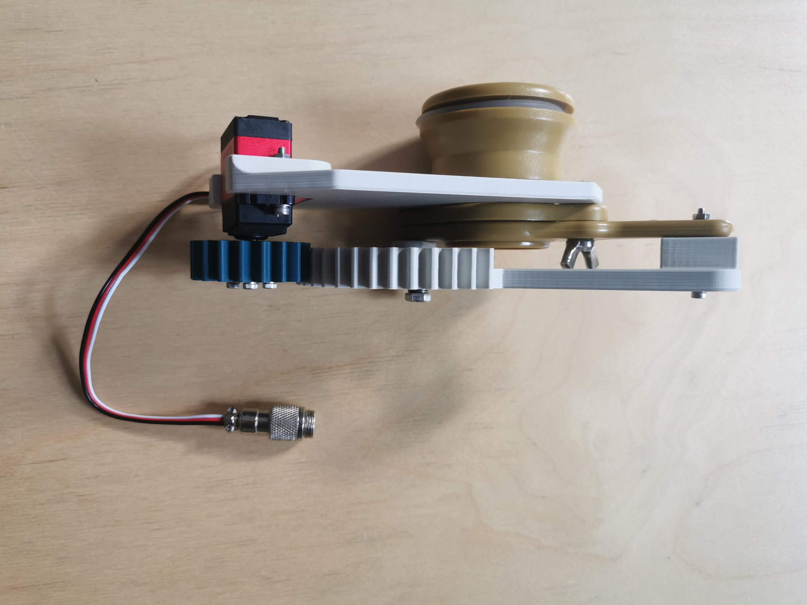

## Variante 5 / Dresden 

Der Vorteil dieser Variante ist die Nutzung eines Zahnradantriebes. Dadurch kann der Quetschhahn auch vollständig geöffnet werden, was vor allem bei sehr zähen Honigen Vorteile bietet. Weiterhin kann dadurch unabhängig vom Öffnungswinkel des Schiebers stets das volle Drehmoment vom Servomotor auf den Schieber übertragen werden. Somit kann der Quetschhahn recht fest angezogen werden und gut abdichten.

Bei dieser Variante ist zu beachten, dass die Drehrichtung des Servomotors anders herum läuft, als beim Antrieb über Gestänge. Aus diesem Grund muss im Source-Code die Option "#define QUETSCHHAHN_LINKS" aktiviert sein. 

    
     

Einige Videos dieser Variante in Aktion sind hier zu finden: \
Abfüllung 250g: https://www.youtube.com/watch?v=SyjUTZp4k2A \
Abfüllung 500g: https://youtube.com/watch?v=RO7_LGpqIUE

Alle 3D-Druck-Teile der "Variante 5 / Dresden" sind verfügbar unter https://www.printables.com/de/model/524971-filling-machine-hanimandl. Dort liegt auch das komplette CAD-Projekt, falls noch Modifikationen nötig sind (z.B. wenn andere Taster oder Bedienelemente verwendet werden sollen).
